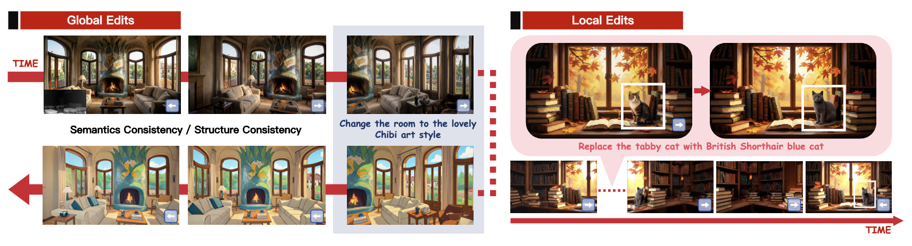

# PermaVid: Consistent Video Generation Across Edits via Disentangled Context Memory
This repository is the official implementation of PermaVid

[**Project page**](https://ys-imtech.github.io/projects/PermaVid/) | [**Paper**](https://arxiv.org/abs/2606.16449) | [**Dataset**](https://huggingface.co/datasets/ysmikey/PermaVid_datasets) 



</br>

[Shuai Yang*](https://ys-imtech.github.io/), 
[Bingjie Gao*](https://whynothaha.github.io/personal_page/), 
[Ziwei Liu](https://liuziwei7.github.io/), 
[Jiaqi Wang](https://myownskyw7.github.io/), 
[Dahua Lin](http://dahua.me/),
[Tong Wu](https://wutong16.github.io/),


<p style="font-size: 0.6em; margin-top: -1em">*Equal Contribution</p>


<p align="center">
<a href="https://arxiv.org/abs/2606.16449">"></a>
<a href="https://ys-imtech.github.io/projects/PermaVid/"></a>
<a href="https://huggingface.co/datasets/ysmikey/PermaVid_datasets"></a>
<a href="https://www.youtube.com/watch?v=DQHfI6btVRk"></a>
<a href="" target='_blank'>

</a>
</p>

## Environment Setup

### 1. Create a Conda Virtual Environment

```bash
conda create -n prismworld python=3.10 -y
conda activate prismworld
```

### 2. Install PyTorch (CUDA 12.6)

```bash
pip install torch==2.7.0 torchvision==0.22.0 --index-url https://download.pytorch.org/whl/cu126
```

> If your CUDA version differs, go to https://pytorch.org/get-started/locally/ and choose the matching installation command.

### 3. Install Project Dependencies

```bash
cd /path/to/prismworld
pip install -U pip
pip install -r requirements.txt
```

### 4. Install Additional Training/Inference Dependencies

```bash
pip install deepspeed wandb scipy matplotlib easydict
pip install qwen-vl-utils
```

### 5. Install the Project in Development Mode

```bash
cd /path/to/prismworld
pip install setuptools
pip install -e .
```

---

## Model Download

```bash
huggingface-cli download Wan-AI/Wan2.1-VACE-14B --local-dir /your/model/Wan2.1-VACE-14B --resume-download
huggingface-cli download ysmikey/prismworld_ckpt_backup   --local-dir /your/model/prismworld --resume-download
huggingface-cli download Qwen/Qwen-Image-Edit --local-dir /your/model/Qwen/Qwen-Image-Edit --resume-download
huggingface-cli download Qwen/Qwen3-VL-8B-Instruct --local-dir /your/model/Qwen/Qwen3-VL-8B-Instruct --resume-download
```

---

## Training

### Training Script

```bash
cd /path/to/prismworld
bash training/train_multi_14b_uemem_mix.sh
```

### Dataset Format

The training metadata CSV contains the following columns:

| Column | Description |
|------|------|
| video | Path to the video MP4 |
| prompt | Text description |
| vace_video | Path to the VACE conditioning video |
| vace_video_mask | VACE mask |
| vace_reference_image | Reference image |
| poses | Path to the camera extrinsics `.npy` file |
| intrinsics | Path to the camera intrinsics `.npy` file |
| original_pose_height | Height corresponding to the original pose |
| original_pose_width | Width corresponding to the original pose |

---

## Inference

### Single-Image Interactive Inference (Keyboard-Controlled Camera)

```bash
bash inference/run_mixmem_stream.sh
```

After launching, control the camera direction interactively via the keyboard (W/A/S/D/arrow keys). The model streams video frames generated according to the camera trajectory.

**Low VRAM variant** (avoids `conda activate`, uses explicit env Python to prevent environment conflicts):

```bash
bash inference/run_mixmem_stream_lowvram.sh
```

## Batch Evaluation

### Batch Editing Evaluation (Global Editing)

```bash
bash inference/run_eval_qualitative_batchedit_global.sh
```

This script processes all images in the test set in parallel, executing a sequence of preset actions on each image:

```bash
preset_actions="w-49-0.05, s-49-0.05, left-49-1.0, right-49-1.0, right-49-1.0, edit: <prompt>, left-49-1.0, left-49-1.0"
```

**Preset action format**:
- `direction-frames-speed`: Camera motion (e.g., `left-49-1.0` means move left for 49 frames at speed 1.0)
- `w/s`: Move forward / backward
- `edit: <prompt>`: Trigger style/scene editing

**Supported editing prompt examples**:
- Style change: `"Turn this photo into a vibrant oil painting..."`
- Season change: `"change the season to autumn/winter"`
- Weather change: `"change the weather to stormy/sunny"`
- Time change: `"change the time to dusk/evening/morning"`

**Low VRAM variant**:

```bash
bash inference/run_eval_qualitative_batchedit_global_lowvram.sh
```

### Batch Editing Evaluation (Local Editing)

```bash
bash inference/run_eval_qualitative_batchedit_local.sh
```

This script evaluates **per-image local edits** across three edit types: `add`, `remove`, and `replace`. Each image must have a corresponding `.txt` file in `testset_local_prompts/`, with three lines corresponding to the three edit types respectively.

The script runs the entire test set three times (once per edit type) and saves results to separate output directories:

```
results_exp/Qualitative_14B_localgood_long_mixmem_add/
results_exp/Qualitative_14B_localgood_long_mixmem_remove/
results_exp/Qualitative_14B_localgood_long_mixmem_replace/
```

The preset action sequence for each image:

```bash
preset_actions="w-49-0.05, s-49-0.05, edit: <per-image prompt>, right-49-0.5, right-49-0.5, left-49-0.5, left-49-0.5, left-49-0.5"
```

**Low VRAM variant** (outputs to `results_exp/Qualitative_14B_localgood_long_mixmem_lowvram_<type>/`):

```bash
bash inference/run_eval_qualitative_batchedit_local_lowvram.sh
```

---


### ✨ TODO:
🔥 We will release the code and models soon!


## 📧 Contact Us
Shuai Yang: [yang_shuai@sjtu.edu.cn](mailto:yang_shuai@sjtu.edu.cn)  
Bingjie Gao: [whynothaha@sjtu.edu.cn](mailto:whynothaha@sjtu.edu.cn)  

## ✒️ Citation
If you find our work helpful for your research, please consider giving a star ⭐ and citation 📝

```bibtex
@misc{yang2026permavid,
      title={PermaVid: Consistent Video Generation Across Edits via Disentangled Context Memory}, 
      author={Shuai Yang and Bingjie Gao and Ziwei Liu and Jiaqi Wang and Dahua Lin and Tong Wu},
      year={2026},
      eprint={2606.16449},
      archivePrefix={arXiv},
      primaryClass={cs.CV},
      url={https://arxiv.org/abs/2606.16449}, 
}
```

---


